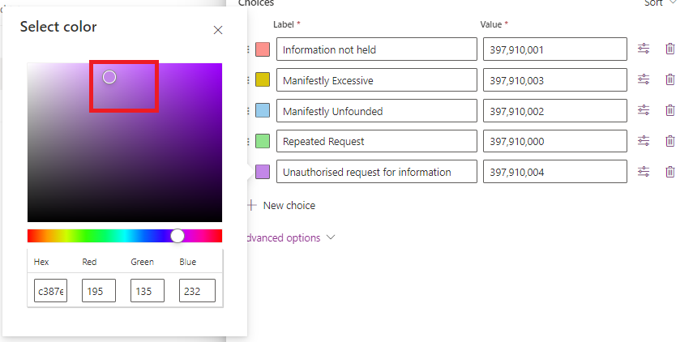

[Dark mode for model-driven apps](https://hackingpowerplatform.com/dark-mode-for-microsoft-dataverse/) can be viewed now using the URL flag

```
&flags=themeOption%3Ddarkmode
```

[Megan Walker's blog post](https://meganvwalker.com/grid-components-in-model-driven-apps-d365/) shows how choice colours are set up and used in model-driven app views. But, how will dark mode impact this?

Potentially it could make some colors difficult to read if light colours are used:


In order to make choices readable in both light and dark mode, a mid-range colour is better:



There are some special cases that need to be taken into account:

- White text doesn't show very well against a yellow background, so a darker shade is needed:


- Black text doesn't show very well against a blue background, so a lighter shade is needed:


This gives:


I've found that it takes a number of iterations to get a good balance over both modes.